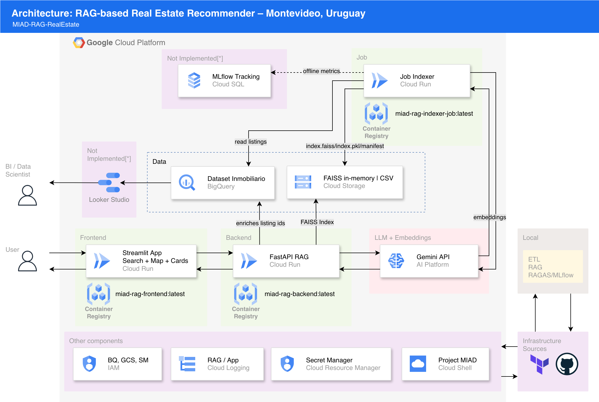
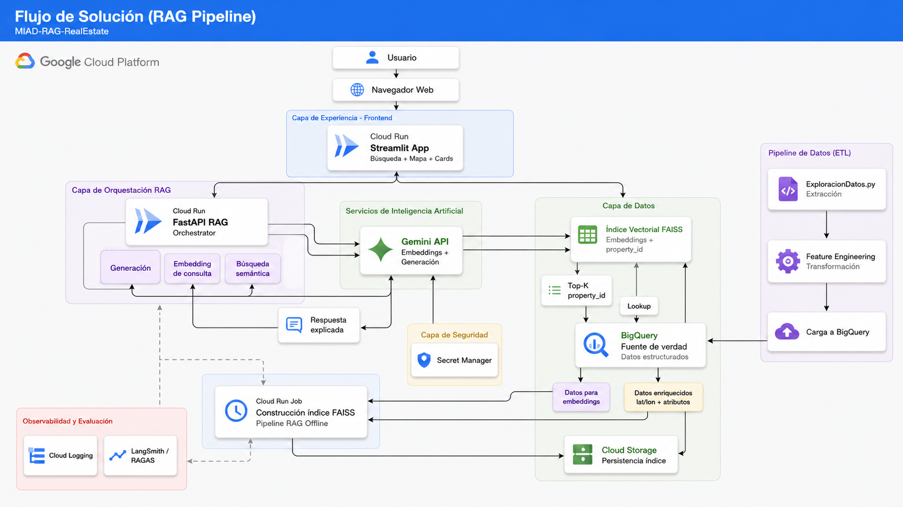
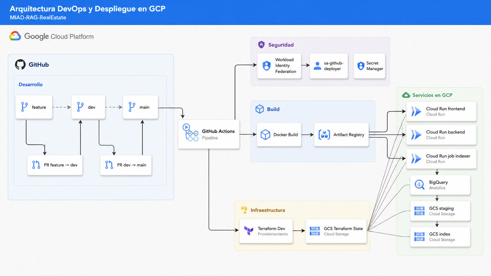
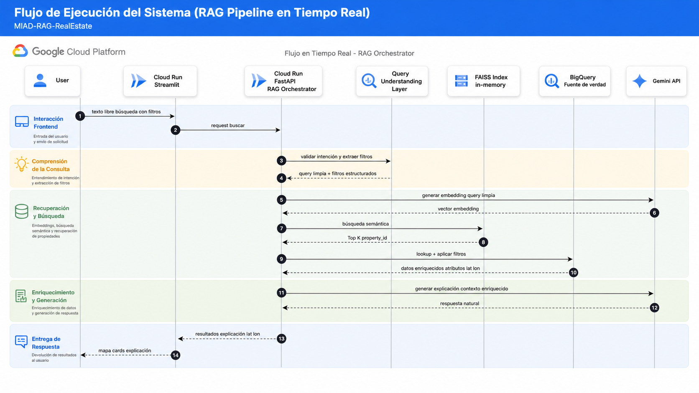

<p align="center">
    
</p>

<p align="left">
  <a href="https://www.python.org/" target="_blank">
    
  </a>
  <a href="https://yaml.org/" target="_blank">
    
  </a>

  <a href="https://cloud.google.com" target="_blank">
    
  </a>
  <a href="https://github.com/features/actions" target="_blank">
    
  </a>
  <a href="https://registry.terraform.io/providers/hashicorp/google/latest/docs" target="_blank">
    
  </a>
  <a href="https://hub.docker.com/" target="_blank">
    
  </a>

  <a href="https://cloud.google.com/run" target="_blank">
    
  </a>
  <a href="https://cloud.google.com/storage" target="_blank">
    
  </a>
  <a href="https://cloud.google.com/artifact-registry" target="_blank">
    
  </a>
  <a href="https://cloud.google.com/secret-manager" target="_blank">
    
  </a>
  <a href="https://cloud.google.com/logging" target="_blank">
    
  </a>
  <a href="https://cloud.google.com/monitoring" target="_blank">
    
  </a>

  <a href="https://flask.palletsprojects.com/" target="_blank">
    
  </a>
  <a href="https://gunicorn.org/" target="_blank">
    
  </a>
  <a href="https://streamlit.io/" target="_blank">
    
  </a>

  <a href="https://ai.google.dev/" target="_blank">
    
  </a>
  <a href="https://faiss.ai/" target="_blank">
    
  </a>
  <a href="https://cloud.google.com/bigquery" target="_blank">
    
  </a>
  <a href="https://pandas.pydata.org/" target="_blank">
    
  </a>

  <a href="https://docs.pytest.org/" target="_blank">
    
  </a>
  <a href="https://github.com/Delgan/loguru" target="_blank">
    
  </a>
  
  <br>
  
  
</p>

# MIAD-RAG-RealEstate
### RAG-based Real Estate Recommendation System on GCP  
**Semantic Search · Explainable AI · Geospatial Analytics**

## Integrantes

A. Barbosa, M. Marin, P. Luissi, R. Mendoza

## Resumen

Sistema de recomendación inmobiliaria basado en **Retrieval-Augmented Generation (RAG)** que permite a los usuarios buscar propiedades mediante lenguaje natural, combinando:

- Búsqueda semántica (FAISS)
- Enriquecimiento estructurado (BigQuery)
- Generación de explicaciones (LLM)
- Visualización geográfica (Streamlit)


## Arquitectura GCP

<p align="center">
    
</p>

**Stack principal:**

- Cloud Run (Frontend + Backend + Job:FAISS)
- BigQuery (datos estructurados)
- Cloud Storage (FAISS backup)
- Secret Manager (seguridad)
- Gemini API (LLM + embeddings)

> [*]: Se deja indicado para una posterior implementación. Fuera del alcance para el curso MIAD-PAAD-202612.

## Flujo de Solución (RAG Pipeline)

Este diagrama resume el flujo de solución del sistema RAG para recomendación inmobiliaria en Montevideo. En la fase offline, los datos obtenidos desde <ins>ExploracionDatos</ins> se transforman, vectorizan y utilizan para construir el índice FAISS, mientras que los atributos estructurados de las propiedades se almacenan en BigQuery. En tiempo real, el usuario interactúa con una interfaz en Streamlit desplegada en Cloud Run, que envía la consulta al backend FastAPI. Allí se recuperan propiedades similares desde FAISS, se enriquecen con información tabular desde BigQuery y finalmente se genera una explicación contextual mediante Gemini. Todo el flujo se apoya en Secret Manager para el manejo seguro de credenciales y en Cloud Logging, LangSmith y RAGAS para trazabilidad, monitoreo y evaluación del sistema.

<p align="center">
    
</p>


> **Nota:** En este proyecto, la capa de análisis no se basa en modelos tradicionales supervisados, sino en un enfoque de recuperación aumentada (RAG), donde el "modelo" está representado por un índice vectorial (FAISS) construido a partir de embeddings generados con Gemini. Este índice permite realizar búsquedas semánticas eficientes sobre las propiedades inmobiliarias, las cuales son posteriormente enriquecidas con datos estructurados desde BigQuery y utilizadas para generar respuestas explicativas mediante un modelo de lenguaje.

## Arquitectura DevOps y Despliegue en GCP
La arquitectura DevOps separa el ciclo de vida de infraestructura y aplicaciones. La infraestructura se gestiona mediante Terraform con estado remoto en Cloud Storage, mientras que los servicios se despliegan como contenedores en Cloud Run. 

El proceso de integración se realiza mediante GitHub Actions, donde las imágenes son construidas y publicadas en Artifact Registry. La autenticación entre GitHub y GCP se realiza usando Workload Identity Federation, evitando el uso de credenciales estáticas.

El despliegue se restringe a la rama `main`, mientras que las ramas `feature` y `dev` se utilizan para desarrollo e integración. Este enfoque permite reproducibilidad, control de cambios y despliegues seguros en la nube.

<p align="center">
    
</p>

La guía operativa para configurar Workload Identity Federation, Terraform state, Secret Manager, Artifact Registry y validación de recursos GCP se encuentra en:

[docs/runbooks/github-actions-gcp-wif.md](./docs/runbooks/github-actions-gcp-wif.md)


## Flujo de Ejecución del Sistema (RAG Pipeline en Tiempo Real)

Este diagrama de secuencia describe el flujo de ejecución del sistema de recomendación basado en **Retrieval-Augmented Generation (RAG)** en tiempo real. A partir de una consulta en lenguaje natural, el frontend en Cloud Run orquesta una solicitud hacia el backend, donde se realiza el procesamiento semántico, la recuperación de propiedades similares mediante FAISS y el enriquecimiento de datos con BigQuery. Posteriormente, se genera una explicación interpretativa utilizando un modelo LLM (Gemini), integrando contexto estructurado y semántico. Finalmente, los resultados son visualizados en la interfaz mediante mapas y tarjetas, proporcionando una experiencia interactiva y explicable para la toma de decisiones inmobiliarias.

<p align="center">
    
</p>


## Estructura del repositorio

Estructura principal

```bash
MIAD-RAG-RealEstate/
├── .github/
│   └── workflows/
│       ├── backend-ci.yml
│       ├── frontend-ci.yml
│       ├── job-ci.yml
│       └── terraform.yml
│
├── infra/                         # Infraestructura como código (Terraform)
│   ├── bootstrap/
│   │   ├── backend.tf
│   │   ├── providers.tf
│   │   └── versions.tf
│   ├── envs/
│   │   └── dev/
│   │       ├── main.tf
│   │       ├── variables.tf
│   │       ├── outputs.tf
│   │       └── terraform.tfvars
│   └── modules/
│       ├── artifact_registry/
│       ├── cloud_run_service/
│       ├── cloud_run_job/
│       ├── bigquery/
│       ├── gcs/
│       ├── iam/
│       └── secrets/
│
├── apps/
│   ├── backend/                   # Cloud Run - RAG Orchestrator
│   │   ├── app/
│   │   │   ├── routers/
│   │   │   ├── services/
│   │   │   │   ├── query_understanding_service.py
│   │   │   │   ├── embedding_service.py
│   │   │   │   ├── retrieval_service.py
│   │   │   │   ├── generation_service.py
│   │   │   │   └── rag_orchestrator_service.py
│   │   │   ├── models/
│   │   │   └── utils/
│   │   ├── tests/
│   │   ├── main.py
│   │   ├── requirements.txt
│   │   └── Dockerfile
│   │
│   ├── frontend/                  # Cloud Run - Streamlit
│   │   ├── app/
│   │   │   ├── pages/
│   │   │   ├── components/
│   │   │   └── main.py
│   │   ├── requirements.txt
│   │   └── Dockerfile
│   │
│   └── job-indexer/              # Cloud Run Job - FAISS builder
│       ├── app/
│       │   ├── build_index.py
│       │   ├── services/
│       │   │   ├── bigquery_reader.py
│       │   │   ├── embedding_service.py
│       │   │   ├── faiss_builder.py
│       │   │   └── gcs_service.py
│       │   └── utils/
│       ├── tests/
│       ├── requirements.txt
│       └── Dockerfile
│
├── shared/                       # Código compartido (NO duplicar lógica)
│   ├── python/
│   │   └── miad_rag_common/
│   │       ├── config/
│   │       ├── schemas/
│   │       ├── logging/
│   │       └── gcp/
│   └── contracts/
│       ├── openapi/
│       ├── jsonschemas/
│       └── examples/
│
├── data/
│   ├── data_dictionary.md
│   ├── samples
│   │   └── real_estate_listings.csv
│   ├── schemas
│   │   ├── rag_eval_results_schema.json
│   │   └── real_estate_listings_schema.json
│   └── scripts
│       ├── generate_sample.py
│       └── load_real_estate_listings.sh
│
├── eval/
│   ├── ragas/
│   │   ├── datasets/
│   │   │   ├── test_queries.csv
│   │   │   └── golden_set.csv
│   │   ├── notebooks/
│   │   └── scripts/
│   └── postman/
│
├── figs/
├── docs/
│   ├── architecture/
│   ├── adr/
│   └── runbooks/
├── .gitignore
└── README.md
```

## Naming Convention (GCP Resources)

| Recurso              | Nombre                          | Descripción                                                                 |
|----------------------|----------------------------------|-----------------------------------------------------------------------------|
| **Project ID**       | `miad-paad-rs-dev`              | Proyecto principal en GCP para el sistema RAG inmobiliario                 |
| **Artifact Registry**| `miad-rag-repo`                 | Repositorio de imágenes Docker (backend, frontend, job)                    |
| **Cloud Run (FE)**   | `miad-rag-frontend`             | Servicio frontend (Streamlit App)                                          |
| **Cloud Run (BE)**   | `miad-rag-backend`              | Servicio backend (FastAPI - RAG Orchestrator)                              |
| **Cloud Run Job**    | `miad-rag-indexer-job`          | Job batch para construcción del índice FAISS                               |
| **Bucket (staging)** | `miad-paad-rs-staging-dev`      | Almacenamiento de CSVs, datasets y artefactos intermedios                  |
| **Bucket (index)**   | `miad-paad-rs-index-dev`        | Almacenamiento de índices vectoriales FAISS                                |
| **BigQuery Dataset** | `ds_miad_rag_rs`                | Dataset principal de datos estructurados                                   |
| **BigQuery Table**   | `real_estate_listings`          | Tabla de propiedades inmobiliarias (fuente de verdad)                      |

> La convención de nombres sigue un patrón consistente basado en {organización}-{curso}-{dominio}-{entorno}, facilitando la trazabilidad, escalabilidad y gobierno de los recursos en GCP.


## .gitignore

Fue generado en [gitignore.io](https://www.toptal.com/developers/gitignore/) con los filtros `python`, `macos`, `windows` y consumido mediante su API como archivo crudo desde la terminal:

```bash
curl -L https://www.toptal.com/developers/gitignore/api/python,macos,windows > .gitignore
```

## Shields, Links

Los shields en las cabeceras de este `Readme.md` se generaron con:

- <a href="https://shields.io/" target="_blank"><span>https://shields.io/</span></a>
- <a href="https://github.com/inttter/md-badges" target="_blank"><span>https://github.com/inttter/md-badges</span></a>

> **NOTA:** Todos los shields y/o enlaces cuando se imprima este `Readme.md` a `.pdf` pueden ser usados haciendo `Ctrl + Clic` (windows) or `Cmd + Clic` (macOS) sobre los mismos.

## Licencia y derechos de autor

El código fuente de este proyecto se distribuye bajo licencia MIT - ver la [LICENCIA](LICENSE) archivo (en inglés) para más detalle.

En caso de utilizar materiales con derechos reservados, estos se emplean únicamente para fines de **investigación, análisis y demostración académica**, sin fines comerciales.