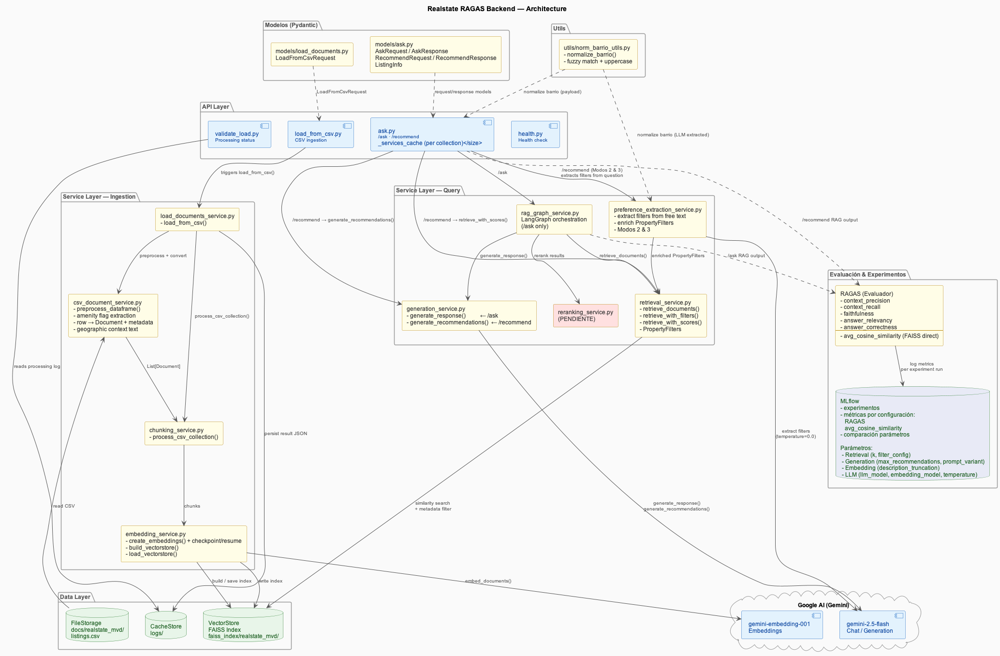

## Integrantes del grupo
A. Barbosa
J. Mario Marin
P. Luissi
R. Mendoza

Backend del Sistema de Recomendación Opciones Inmobiliarias Arriendo|Compra Casas|Apartementos Montevideo

---

##  Tabla de Contenidos

- [ Descripción](#descripción)
- [ Arquitectura del Sistema](#arquitectura)
- [ Estructura del Proyecto](#estructura)
- [ Documentación del API](#api)
- [ Despliegue en Cloud Run](#cloud-run)
- [ Ejecución con Docker](#docker)
- [ Observabilidad con LangSmith](#langsmith)

---

##  <a id="descripción"></a>Descripción

Sistema **RAG (Retrieval-Augmented Generation)** desarrollado en **FastAPI** que permite:

- Carga y procesamiento automático de documentos desde `docs/` (docs/realstate_mvd/listings por defecto)
- Procesamiento de archivos csv (que almacena las publicaciones inmobiliarias)
- Búsqueda semántica con vectores FAISS y embeddings Gemini
- Reranking adaptativo: ms-marco **PENDIENTE**
- Evaluación con RAGAS y observabilidad con LangSmith 
---

##  <a id="arquitectura"></a>Arquitectura del Sistema



### **API Layer**

Manejo de peticiones HTTP y validación de datos:

- `load_from_csv.py`: Carga asíncrona de documentos desde docs/realstate_mvd 
- `ask.py`: Sistema de consultas RAG 
- `validate_load.py`: Validación de estado de procesamiento asíncrono
- `health.py`: Monitoreo de salud del sistema

### **Service Layer**

Lógica de negocio y orquestación:

- **Document Service**: Descarga y gestión de documentos (localmente por ahora, luego desde BigQuery). (`load_documents_service.py`)
- **Chunking Service**: Fragmentación de documentos (`chunking_service.py`). Se conserva a estructura de un RAG convencional (flexibilizado para aceptar documentos distinta natruraleza en el futuro) sin embargo, en esta caso cada listing dentro del csv se trata como un chunk individual. 
- **CSV Document Service**:Convierte las filas del CSV de listings inmobiliarios en objetos Document de LangChain, listos para ser embebidos y almacenados en FAISS (`csv_document_service`)
-  **Preference Extraction Service**: Extrae filtros estructurados (PropertyFilters) a partir de texto libre del usuario, usando Gemini para interpretar intenciones y preferencias de búsqueda.
- **Embedding Service**: Generación de embeddings con Gemini y gestión del índice FAISS (`embedding_service.py`)
- **RAG Graph Service**: Orquestación del flujo RAG con LangGraph (`rag_graph_service.py`). Incluye nodos de reescritura de consulta (para desarrollo futuro), retrieval, reranking adaptativo y generación.
- **Retrieval Service**: Búsqueda de similitud semántica en el vectorstore FAISS (`retrieval_service.py`)
- **Reranking Service**: Reranking adaptativo con Cross-Encoder (`reranking_service.py`) **PENDIENTE**
- **Generation Service**: Generación de respuestas con Gemini (`generation_service.py`). De

### **Data Layer**

Persistencia y almacenamiento:

- **FileStorage** (`docs/`): almacen csv con listado del inmuebles
- **VectorStore** (`faiss_index/`): Índice vectorial FAISS con embeddings Gemini
- **CacheStore** (`logs/`): Logs de procesamiento y resultados

---

## <a id="estructura"></a>Estructura del Proyecto

```
RAGAS-Backend/
├── app/
│   ├── models/                                 # Modelos Pydantic
│   │   ├── ask.py                              # Modelos para consultas RAG
│   │   └── load_documents.py                   # Modelos para carga de documentos
│   ├── routers/                                # Endpoints de la API
│   │   ├── ask.py                              # Consultas RAG
│   │   ├── load_from_csv.py                    # Carga de documentos
│   │   ├── load_from_url.py                    # Carga de documentos desde url # USO FUTURO
│   │   ├── validate_load.py                    # Validación de procesamiento
│   │   └── health.py                           # Health check
│   ├── services/                               # Servicios de negocio
│   │   ├── chunking_service.py                 # Fragmentación de documentos
|   │   ├── csv_document_service.py             # Procesamiento de csv 
│   │   ├── embedding_service.py                # Generación de embeddings
│   │   ├── generation_service.py               # Generación de respuestas (Gemini)
│   │   ├── load_documents_service.py           # Procesamiento de documentos
|   │   ├── preference_extraction_service.py    # Procesamiento de documentos
│   │   ├── rag_graph_service.py                # Orquestación con LangGraph
│   │   ├── reranking_service.py                # Reranking con Cross-Encoder
│   │   └── retrieval_service.py                # Búsqueda semántica
│   └── utils/                                  # Utilidades compartidas
│       └── text_utils.py                       # Normalización de texto (PDFs) USO FUTURO 
│       └── norm_barrio_utils.py                # Normalización de Barrio 
├── diagrams/                                   # Diagrams Backend
├── docs/                                       # Documentos descargados 
│    └── realstate_mvd/                         # collection 
│           └── listings.csv                    # listings (local)
├── faiss_index/                                # Índices vectoriales (auto-generado)
│    └── realstate_mvd/                         # collection
│           ├── index.faiss                     # vector index (embeddings)
│           └── index.pkl                       # metadata (barrio_fixed, price, amenities, etc. per listing)
├── tests/                                      # Tests 
│   └── ragas/                                  # Tests de evaluación RAGAS
├── main.py                                     # Configuración FastAPI
├── requirements.txt                            # Dependencias Python
├── Dockerfile                                  # Configuración Docker
├── docker-compose.yml                          # Orquestación Docker
├── pytest.ini                                  # Configuración pytest
├── .env                                        # Variables de entorno (agregar)
├── apikey.json                                 # Service account Google Drive 
└── logs/                                       # Logs de procesamiento (auto-generado)
```

---

##  <a id="api"></a>Documentación del API

### Documentación Completa

- [Documentación del API](resumenAPI.md) - Especificación técnica completa

---

##  Flujo de Datos

### 1. Carga de Documentos (csv)
```
POST /load-from-csv → Load Document Service → Process_csv → Embedding → FAISS Index
```

###  2. Consulta RAG
```
POST /ask → RAG Graph Service
    → [Query Rewriting] → Retrieval → 
    → Generation (Gemini, idioma detectado) → Response
```
```
POST /recommend → RAG 
    → PreferenceExtractionService → Retrieval
    → Generation (Gemini, idioma detectado) → Response
```

### 3. Validación
```
GET /load-from-csv/{id} → Logs + FAISS Status → Validation Response
```

---

##  <a id="docker"></a>Ejecución con Docker

### Requisitos previos
- Docker y Docker Compose instalados
- Archivo `.env` 

### Variables de entorno requeridas

Un ejemplo de este archivo está disponible en \local_tests\.ejemplo_env

```.env
GOOGLE_API_KEY=your_gemini_api_key

# Opcional para trazabiliadad. 
LANGCHAIN_API_KEY=your_langsmith_api_key
LANGCHAIN_TRACING_V2=true
LANGCHAIN_PROJECT= SucasaYa
```

### Levantar el contenedor

- Asegúrate de tener Docker instalado y corriendo. 
- Asegúrate de tener el archivo de varibales de entorno .env en el directorio raiz.
- Asegúrate de tener el archivo "listings.csv" en docs/realstate_mvd 

```bash
# Construir y levantar el contenedor
docker-compose up --build

# O en modo detached (background)
docker-compose up -d
```

El servidor estará disponible en: `http://localhost:8000`

### Comandos útiles

```bash
# Ver logs
docker-compose logs -f

# Detener el contenedor
docker-compose down

# Reconstruir la imagen
docker-compose build --no-cache

# Limpiar caché de Python antes de reiniciar
find . -type d -name __pycache__ -exec rm -rf {} + 2>/dev/null
```
>
>Lo primero que debes hacer antes de realizar una consulta es construir el indice Faiss. Utiliza el >endpoint POST /load-from-csv para realizar esta operación. Ten en cuenta que esta construcción puede >tardar hasta 15 minutos
>

---

##  <a id="langsmith"></a>Observabilidad con LangSmith -OPCIONAL-

El sistema integra **LangSmith** para trazabilidad completa del pipeline RAG:

- Trazas de cada consulta: reescritura → retrieval → reranking → generación
- Scores de reranking por documento (`rerank_score` en metadata)
- Latencia por nodo del grafo LangGraph
- Evaluación RAGAS integrada con métricas por configuración

Para acceder al dashboard de LangSmith, configura `LANGCHAIN_API_KEY` y `LANGCHAIN_PROJECT` en tu `.env`.

---

**Curso**: MIID4401 - Proyecto Aplicado Analítica de Datos
**Universidad**: Universidad de los Andes - Maestría en Inteligencia Analítica de Datos
**Año**: 2026-12
