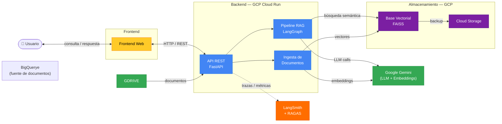

#  - Sistema RAG 

## Integrantes del grupo
Alejandra Barbosa Contreras  
Jorge Mario Marin
Paulina Luissi
Ronald (Rony) Mendoza Canales 

Backend del Sistema de Recomendación Opciones Inmobiliarias Arriendo|Compra Casas|Apartementos Montevideo

---

##  Tabla de Contenidos

- [ Descripción](#descripción)
- [ Arquitectura del Sistema](#arquitectura)
- [ Estructura del Proyecto](#estructura)
- [ Documentación del API](#api)
- [ Despliegue en Cloud Run](#cloud-run)
- [ Ejecución con Docker](#docker)
- [ Observabilidad con LangSmith](#langsmith)

---

##  <a id="descripción"></a>Descripción

Sistema **RAG Multimodal (Retrieval-Augmented Generation)** desarrollado en **FastAPI** que permite:

- Carga y procesamiento automático de documentos desde XXXX 
- Procesamiento  de csvs
- Búsqueda semántica con vectores FAISS y embeddings Gemini
- Reranking adaptativo: ms-marco **PEDIENTE**
- Reescritura de consultas con LangGraph **PROBABLEMENTE NO**
- Evaluación con RAGAS y observabilidad con LangSmith **Este ultimo PENDIENTE**

---

##  <a id="arquitectura"></a>Arquitectura del Sistema

El sistema está diseñado con una **arquitectura de tres capas** que separa responsabilidades y facilita el mantenimiento:
**OJO este diagraga requiere actualizacion**

### **API Layer**

Manejo de peticiones HTTP y validación de datos:

- `load_from_csv.py`: Carga asíncrona de documentos desde csv (local por ahora) PENDIENTE
- `ask.py`: Sistema de consultas RAG 
- `validate_load.py`: Validación de estado de procesamiento asíncrono
- `health.py`: Monitoreo de salud del sistema

### **Service Layer**

Lógica de negocio y orquestación:

- **Document Service**: Descarga y gestión de documentos desde BigQuery (`load_documents_service.py`)
- **Chunking Service**: Fragmentación de documentos (`chunking_service.py`). Se conserva a estructura de un RAG convencional sin embargo en esta caso cada listing es un documento. 
- **CSV Document Service**:Convierte las filas del CSV de listings inmobiliarios en objetos Document de LangChain, listos para ser embebidos y almacenados en FAISS 
- **Embedding Service**: Generación de embeddings con Gemini y gestión del índice FAISS (`embedding_service.py`)
- **RAG Graph Service**: Orquestación del flujo RAG con LangGraph (`rag_graph_service.py`). Incluye nodos de reescritura de consulta, retrieval, reranking adaptativo y generación.
- **Query Rewriting Service**: Reescritura de consultas para mejorar el retrieval (`query_rewriting_service.py`). **PENDIENTE**
- **Retrieval Service**: Búsqueda de similitud semántica en el vectorstore FAISS (`retrieval_service.py`)
- **Reranking Service**: Reranking adaptativo con Cross-Encoder (`reranking_service.py`). Usa `ms-marco-MiniLM-L-6-v2` para chunks con contenido visual (`[FIGURA]`, tablas). Chunks de texto puro no pasan por el reranking (`bypass_text_reranking=True`) según resultados de evaluación RAGAS. **PENDIENTE**
- **Generation Service**: Generación de respuestas con Gemini (`generation_service.py`). De

### **Data Layer**

Persistencia y almacenamiento:

- **FileStorage** (`docs/`): Documentos originales descargados
- **VectorStore** (`faiss_index/`): Índice vectorial FAISS con embeddings Gemini
- **CacheStore** (`logs/`): Logs de procesamiento y resultados

---

## <a id="estructura"></a>Estructura del Proyecto

```
RAGAS-Backend/
├── app/
│   ├── models/                         # Modelos Pydantic
│   │   ├── ask.py                      # Modelos para consultas RAG
│   │   └── load_documents.py           # Modelos para carga de documentos
│   ├── routers/                        # Endpoints de la API
│   │   ├── ask.py                      # Consultas RAG
│   │   ├── load_from_csv.py            # Carga de documentos
│   │   ├── validate_load.py            # Validación de procesamiento
│   │   └── health.py                   # Health check
│   ├── services/                       # Servicios de negocio
│   │   ├── chunking_service.py         # Fragmentación de documentos
|   │   ├── csv_document_service.py     # Procesamiento de csv 
│   │   ├── embedding_service.py        # Generación de embeddings
│   │   ├── generation_service.py       # Generación de respuestas (Gemini)
│   │   ├── retrieval_service.py        # Búsqueda semántica
│   │   ├── rag_graph_service.py        # Orquestación con LangGraph
│   │   ├── reranking_service.py        # Reranking con Cross-Encoder
│   │   ├── query_rewriting_service.py  # Reescritura de consultas
│   │   ├── google_drive.py             # Integración Google Drive
│   │   └── load_documents_service.py   # Procesamiento de documentos
│   └── utils/                          # Utilidades compartidas
│       └── text_utils.py               # Normalización de texto (PDFs) PENDIENTE SI NO IMPLEMENTAMOS BORRAR
│       └── norm_barrio_utils.py        # Normalización de Barrio 
├── tests/                              # Tests 
│   ├── chunking/                       # Tests de fragmentación
│   ├── embedding/                      # Tests de embeddings
│   ├── retrieval/                      # Tests de recuperación
│   ├── generation/                     # Tests de generación
│   ├── ragas/                          # Tests de evaluación RAGAS
│   └── postman_tests/                  # Colecciones Postman
├── main.py                             # Configuración FastAPI
├── requirements.txt                    # Dependencias Python
├── Dockerfile                          # Configuración Docker
├── docker-compose.yml                  # Orquestación Docker
├── pytest.ini                          # Configuración pytest
├── .env                                # Variables de entorno (agregar)
├── apikey.json                         # Service account Google Drive 
├── docs/                               # Documentos descargados (auto-generado)
│    └── realstate_mvd/                 # collection
│           ├── listings.csv            # listings (local)
├── faiss_index/                        # Índices vectoriales (auto-generado)
│    └── realstate_mvd/                 # collection
│           ├── index.faiss             # vector index (embeddings)
│           └── index.pkl               # metadata (barrio, price, amenities, etc. per listing)
└── logs/                               # Logs de procesamiento (auto-generado)
```

---

##  <a id="api"></a>Documentación del API

### Documentación Completa

- [Documentación del API](resumenAPI.md) - Especificación técnica completa

---

##  Flujo de Datos

### 1. Carga de Documentos (texto)
```
POST /load-from-url → Document Service → Chunking Service → normalize_text → Embedding → FAISS Index
```

### 2. Carga de Documentos (multimodal)
```
POST /load-from-url (multimodal=true) → Document Service → Chunking Service
    → MultimodalDocumentService → [PyMuPDF texto + pdfplumber tablas + Gemini VLM imágenes]
    → normalize_text → Embedding → FAISS Index
```

### 3. Consulta RAG
```
POST /ask → RAG Graph Service
    → [Query Rewriting] → Retrieval → [Reranking si contenido visual]
    → Generation (Gemini, idioma detectado) → Response
```

### 4. Validación
```
GET /load-from-url/{id} → Logs + FAISS Status → Validation Response
```

---

## 🚀 <a id="cloud-run"></a>Despliegue

La aplicación frontend está desplegada en:

**

---

##  <a id="docker"></a>Ejecución con Docker

### Requisitos previos
- Docker y Docker Compose instalados
- Archivos `.env` y `apikey.json` configurados

### Variables de entorno requeridas

```env
GOOGLE_API_KEY=your_gemini_api_key
LANGCHAIN_API_KEY=your_langsmith_api_key
LANGCHAIN_TRACING_V2=true
LANGCHAIN_PROJECT= SucasaYa
```

### Levantar el contenedor

```bash
# Construir y levantar el contenedor
docker-compose up --build

# O en modo detached (background)
docker-compose up -d
```

El servidor estará disponible en: `http://localhost:8000`

### Comandos útiles

```bash
# Ver logs
docker-compose logs -f

# Detener el contenedor
docker-compose down

# Reconstruir la imagen
docker-compose build --no-cache

# Limpiar caché de Python antes de reiniciar
find . -type d -name __pycache__ -exec rm -rf {} + 2>/dev/null
```

---

##  <a id="langsmith"></a>Observabilidad con LangSmith

El sistema integra **LangSmith** para trazabilidad completa del pipeline RAG:

- Trazas de cada consulta: reescritura → retrieval → reranking → generación
- Scores de reranking por documento (`rerank_score` en metadata)
- Latencia por nodo del grafo LangGraph
- Evaluación RAGAS integrada con métricas por configuración

Para acceder al dashboard de LangSmith, configura `LANGCHAIN_API_KEY` y `LANGCHAIN_PROJECT` en tu `.env`.

---

**Curso**: MIID4401 - Proyecto Aplicado Analítica de Datos
**Universidad**: Universidad de los Andes - Maestría en Inteligencia Analítica de Datos
**Año**: 2026-12
