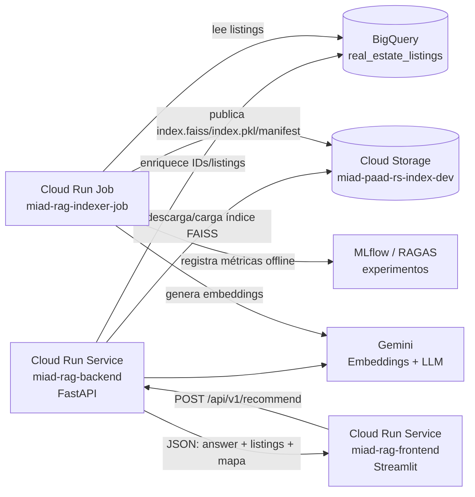

# Data Dictionary - real_estate_listings

Este documento describe el mapeo entre el dataset CSV enriquecido y la tabla final en BigQuery para `real_estate_listings`.

## Reglas de normalización aplicadas

- Todos los nombres de columnas en BigQuery se definen en minúsculas.
- Se usa `snake_case`.
- No se usan puntos `.` en nombres de columnas; se reemplazan por `_`.
- Las columnas del CSV se preservan tal como vienen en origen.
- Las columnas de BigQuery reflejan el esquema final de almacenamiento.

> Se genera un subconjunto anonimizado del dataset mediante codificación base64 sobre atributos sensibles, preservando estructura y distribución para pruebas del sistema RAG sin exponer datos reales.

## Tabla de mapeo

| columna_csv | columna_bigquery | tipo_sugerido_csv | tipo_sugerido_bigquery | descripcion |
| :--- | :--- | :--- | :--- | :--- |
| id | id | object | STRING | Identificador único del anuncio (Primary Key). |
| scraped_at | scraped_at | object | DATE | Fecha y hora exacta de la captura del dato. |
| operation_type | operation_type | object | STRING | Tipo de operación: Venta o Alquiler. |
| property_type | property_type | object | STRING | Categoría del inmueble (Apartamento, Casa, etc.). |
| l3 | l3 | object | STRING | Nivel 3 de localización (barrio o zona específica). |
| title | title | object | STRING | Título descriptivo original. |
| description | description | object | STRING | Descripción detallada original. |
| status | status | object | STRING | Estado de la publicación en la plataforma. |
| seller_name | seller_name | object | STRING | Nombre del anunciante o inmobiliaria. |
| seller_type | seller_type | object | STRING | Tipo de vendedor (dueño o inmobiliaria). |
| seller_id | seller_id | float64 | FLOAT | Identificador del vendedor. |
| url | url | object | STRING | Enlace directo a la publicación. |
| image_urls | image_urls | object | STRING | Lista de enlaces a las fotografías. |
| thumbnail_url | thumbnail_url | object | STRING | Enlace a la imagen miniatura. |
| bedrooms | bedrooms | float64 | FLOAT | Cantidad de dormitorios. |
| bathrooms | bathrooms | float64 | FLOAT | Cantidad de baños. |
| garages | garages | float64 | FLOAT | Cantidad de espacios de estacionamiento. |
| surface_total | surface_total | float64 | FLOAT | Superficie total en m². |
| surface_covered | surface_covered | float64 | FLOAT | Superficie construida en m². |
| floor | floor | float64 | FLOAT | Número de piso. |
| age | age | float64 | FLOAT | Antigüedad del inmueble. |
| condition | condition | object | STRING | Estado de la propiedad (Nuevo/Usado). |
| expenses | expenses | float64 | FLOAT | Monto de gastos comunes o expensas. |
| amenities | amenities | object | STRING | Lista de servicios adicionales (Piscina, Gym, etc.). |
| price | price | float64 | FLOAT | Precio original publicado. |
| currency | currency | object | STRING | Moneda original (USD, UYU). |
| price_fixed | price_fixed | float64 | FLOAT | Precio normalizado (ETL). |
| currency_fixed | currency_fixed | object | STRING | Moneda de referencia normalizada. |
| price_m2 | price_m2 | float64 | FLOAT | Precio calculado por metro cuadrado. |
| price_m2_basis | price_m2_basis | object | STRING | Base del cálculo de m² (total o cubierta). |
| lat | lat | float64 | FLOAT | Latitud geográfica. |
| lon | lon | float64 | FLOAT | Longitud geográfica. |
| geometry | geometry | geometry | GEOGRAPHY | Objeto geométrico para procesamiento espacial. |
| barrio_fixed | barrio_fixed | object | STRING | Nombre del barrio normalizado tras proceso de limpieza. |
| nrobarrio | nrobarrio | float64 | FLOAT | Código numérico oficial del barrio. |
| departamen | departamen | object | STRING | Departamento administrativo (Montevideo). |
| zona_legal | zona_legal | object | STRING | Jurisdicción legal asociada (CCZ). |
| seccion_pol | seccion_pol | float64 | FLOAT | Sección policial correspondiente. |
| codba | codba | object | STRING | Código de base asociado al barrio. |
| barrio_confidence | barrio_confidence | object | STRING | Nivel de confianza de la asignación geográfica del barrio. |
| operation_check | operation_check | object | STRING | Validación de consistencia del tipo de operación. |
| is_dual_intent | is_dual_intent | object | BOOL | Indica si el aviso sugiere tanto venta como alquiler. |
| title_clean | title_clean | object | STRING | Título limpio para procesamiento RAG. |
| description_clean | description_clean | object | STRING | Descripción limpia para generación de embeddings. |
| barrio | barrio | object | STRING | Nombre del barrio original (Join Espacial). |
| n_public_spaces_800m | n_public_spaces_800m | int64 | INTEGER | Cantidad de espacios públicos en 800m. |
| dist_nearest_public_space | dist_nearest_public_space | float64 | FLOAT | Distancia al espacio público más cercano. |
| public_space_area_800m | public_space_area_800m | float64 | FLOAT | Área total de espacios públicos en 800m. |
| n_espacio_libre_800m | n_espacio_libre_800m | int64 | INTEGER | Cantidad de espacios libres en 800m. |
| dist_espacio_libre | dist_espacio_libre | float64 | FLOAT | Distancia al espacio libre más cercano. |
| area_espacio_libre_800m | area_espacio_libre_800m | float64 | FLOAT | Área de espacios libres en 800m. |
| n_plaza_800m | n_plaza_800m | int64 | INTEGER | Cantidad de plazas en 800m. |
| dist_plaza | dist_plaza | float64 | FLOAT | Distancia a la plaza más cercana. |
| area_plaza_800m | area_plaza_800m | float64 | FLOAT | Área de plazas en 800m. |
| n_ord_transito_800m | n_ord_transito_800m | int64 | INTEGER | Cantidad de áreas de ordenamiento de tránsito en 800m. |
| dist_ord_transito | dist_ord_transito | float64 | FLOAT | Distancia al área de tránsito más cercana. |
| area_ord_transito_800m | area_ord_transito_800m | float64 | FLOAT | Área de ordenamiento de tránsito en 800m. |
| n_plazoleta_800m | n_plazoleta_800m | int64 | INTEGER | Cantidad de plazoletas en 800m. |
| dist_plazoleta | dist_plazoleta | float64 | FLOAT | Distancia a la plazoleta más cercana. |
| area_plazoleta_800m | area_plazoleta_800m | float64 | FLOAT | Área de plazoletas en 800m. |
| n_isla_800m | n_isla_800m | int64 | INTEGER | Cantidad de islas en 800m. |
| dist_isla | dist_isla | float64 | FLOAT | Distancia a la isla más cercana. |
| area_isla_800m | area_isla_800m | float64 | FLOAT | Área de islas en 800m. |
| n_playa_800m | n_playa_800m | int64 | INTEGER | Cantidad de playas en 800m. |
| dist_playa | dist_playa | float64 | FLOAT | Distancia a la playa más cercana. |
| area_playa_800m | area_playa_800m | float64 | FLOAT | Área de playas en 800m. |
| n_escuelas_800m | n_escuelas_800m | int64 | INTEGER | Cantidad de escuelas en 800m. |
| dist_nearest_escuela | dist_nearest_escuela | float64 | FLOAT | Distancia a la escuela más cercana. |
| n_primaria_800m | n_primaria_800m | int64 | INTEGER | Cantidad de primarias en 800m. |
| dist_primaria | dist_primaria | float64 | FLOAT | Distancia a la primaria más cercana. |
| n_secundaria_800m | n_secundaria_800m | int64 | INTEGER | Cantidad de secundarias en 800m. |
| dist_secundaria | dist_secundaria | float64 | FLOAT | Distancia a la secundaria más cercana. |
| n_tecnica_800m | n_tecnica_800m | int64 | INTEGER | Cantidad de UTU/Técnica en 800m. |
| dist_tecnica | dist_tecnica | float64 | FLOAT | Distancia a la técnica más cercana. |
| n_formacion_docente_800m | n_formacion_docente_800m | int64 | INTEGER | Cantidad de formación docente en 800m. |
| dist_formacion_docente | dist_formacion_docente | float64 | FLOAT | Distancia a formación docente más cercana. |
| n_destinos_800m | n_destinos_800m | int64 | INTEGER | Cantidad de puntos de interés en 800m. |
| dist_nearest_destino | dist_nearest_destino | float64 | FLOAT | Distancia al punto de interés más cercano. |
| n_comercial_800m | n_comercial_800m | int64 | INTEGER | Cantidad de comercios en 800m. |
| dist_comercial | dist_comercial | float64 | FLOAT | Distancia al comercio más cercano. |
| n_gubernamental_800m | n_gubernamental_800m | int64 | INTEGER | Cantidad de oficinas de gobierno en 800m. |
| dist_gubernamental | dist_gubernamental | float64 | FLOAT | Distancia al edificio gubernamental más cercano. |
| n_industrial_800m | n_industrial_800m | int64 | INTEGER | Cantidad de zonas industriales en 800m. |
| dist_industrial | dist_industrial | float64 | FLOAT | Distancia a zona industrial más cercana. |


## Notas de implementación

- `real_estate_listings` es la fuente de verdad estructurada del sistema.
- El índice FAISS no reemplaza esta tabla; almacena embeddings y referencias por `property_id`.
- Las columnas con nombres originales en mayúsculas o con punto se normalizan para BigQuery.
- Si el CSV conserva listas u objetos serializados, campos como `image_urls`, `amenities` y `geometry` pueden cargarse inicialmente como `STRING`, a excepción de `geometry`, para más información ver [BigQuery: Trabajar con datos geoespaciales](https://docs.cloud.google.com/bigquery/docs/geospatial-data?hl=es#python)


## Gestión de Datos

El diccionario de datos y el esquema utilizado en BigQuery se encuentran en:

```text
data/schemas/real_estate_listings_schema.json
```

El proceso de carga se realiza desde Cloud Shell mediante:

```text
data/scripts/load_real_estate_listings.sh
```

Este script:
- Sube el CSV a Cloud Storage
- Inserta los datos en BigQuery usando el esquema definido

---

### Flujo de Datos del Artefacto:

La separación sanitizada quedaría así:

`job-indexer` construye el índice. Lee `miad-paad-rs-dev.ds_miad_rag_rs.real_estate_listings`, transforma cada fila en documento RAG, genera embeddings, construye FAISS y publica artefactos en `gs://miad-paad-rs-index-dev`.

`backend` no construye índices en caliente. Solo descarga/carga el índice vigente, recibe peticiones del frontend, aplica filtros + búsqueda semántica, recupera IDs, consulta BigQuery para enriquecer las propiedades y genera la respuesta narrativa.

`frontend` no sabe nada de FAISS ni BigQuery. Solo arma la petición, consume /api/v1/recommend, renderiza cards, tabla y puntos en mapa.

