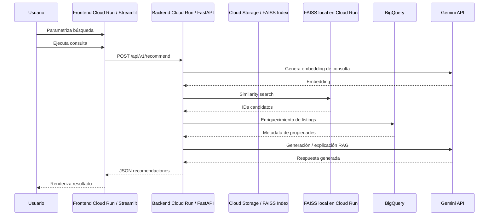

# Observability Latency Runbook

## MIAD RAG Real Estate — Medición de tiempos end-to-end

Este documento describe cómo medir los tiempos de respuesta del recomendador inmobiliario desde que el usuario lanza una búsqueda en el frontend hasta que recibe la respuesta renderizada.

El objetivo es separar la medición en dos niveles:

1. **Medición inmediata con logs nativos de Cloud Run**  
   Permite medir latencias HTTP del frontend y backend sin modificar código.

2. **Medición fina por building blocks del flujo RAG**  
   Permite medir tiempos internos del backend: embeddings, FAISS, BigQuery, generación con Gemini, serialización y renderizado en frontend.  
   Este nivel requiere agregar logs estructurados en frontend y backend.

---

## 1. Ventana de medición solicitada

La medición debe tomar como rango principal:

| Zona horaria | Inicio inclusivo | Fin inclusivo |
|---|---:|---:|
| America/Bogota | `2026-05-11 00:00:00` | `2026-05-13 23:59:59` |

Como Cloud Logging y BigQuery trabajan normalmente con timestamps UTC, el rango equivalente recomendado para consultas es:

| Zona horaria | Inicio inclusivo | Fin exclusivo recomendado |
|---|---:|---:|
| UTC | `2026-05-11T05:00:00Z` | `2026-05-14T05:00:00Z` |

Se usa **fin exclusivo** para evitar problemas de precisión con milisegundos, microsegundos o nanosegundos:

```sql
timestamp >= TIMESTAMP("2026-05-11T05:00:00Z")
AND timestamp < TIMESTAMP("2026-05-14T05:00:00Z")
```

Esto captura todo lo ocurrido desde el lunes 11 de mayo de 2026 a las 00:00:00 en Colombia hasta el miércoles 13 de mayo de 2026 a las 23:59:59 en Colombia.

---

## 2. Arquitectura observada

Flujo funcional del recomendador:



Servicios principales en ambiente dev:

| Componente | Valor |
|---|---|
| Proyecto GCP | `miad-paad-rs-dev` |
| Región | `us-east4` |
| Frontend Cloud Run | `miad-rag-frontend` |
| Backend Cloud Run | `miad-rag-backend` |
| Bucket índice FAISS | `miad-paad-rs-index-dev` |
| Dataset BigQuery | `ds_miad_rag_rs` |
| Tabla BigQuery | `real_estate_listings` |

---

## 3. Qué se puede medir sin modificar código

Con los request logs nativos de Cloud Run se puede medir:

| Bloque | Fuente | Qué mide |
|---|---|---|
| Usuario → Frontend | Request logs del frontend | Latencia HTTP del frontend |
| Frontend → Backend | Request logs del backend | Latencia HTTP del backend |
| Backend total | Request logs backend | Tiempo completo de `/api/v1/recommend` o `/api/v1/ask` |
| Errores HTTP | Request logs | Estados 4xx / 5xx |
| IP aproximada | `httpRequest.remoteIp` | IP vista por Cloud Run |
| User agent | `httpRequest.userAgent` | Navegador / cliente |
| Trace | `trace` | Correlación parcial de logs |

Limitación importante:

> Los request logs nativos no permiten separar internamente cuánto tomó Gemini, FAISS, BigQuery o la serialización de respuesta. Para eso se requiere instrumentación estructurada en el código.

---

## 4. Qué requiere instrumentación adicional

Para obtener un timeline real por solicitud se deben emitir logs JSON desde frontend y backend.

Etapas recomendadas:

| Orden | Stage | Componente |
|---:|---|---|
| 10 | `frontend_search_submitted` | Frontend |
| 20 | `frontend_backend_call` | Frontend |
| 30 | `backend_request_total` | Backend |
| 40 | `query_understanding` | Backend |
| 50 | `gemini_embedding` | Backend |
| 60 | `faiss_retrieval` | Backend |
| 70 | `bigquery_enrichment` | Backend |
| 80 | `gemini_generation` | Backend |
| 90 | `response_serialization` | Backend |
| 100 | `frontend_response_rendered` | Frontend |

Formato sugerido del log estructurado:

```json
{
  "event_type": "rag_timing",
  "request_id": "uuid",
  "session_id_hash": "hash",
  "component": "backend",
  "stage_order": 70,
  "stage": "bigquery_enrichment",
  "duration_ms": 438.7,
  "status": "ok",
  "records_found": 10
}
```

Para eventos de sesión en frontend:

```json
{
  "event_type": "frontend_session_event",
  "event_name": "search_submitted",
  "session_id_hash": "hash",
  "request_id": "uuid",
  "status": "ok"
}
```

---

## 5. Privacidad y trazabilidad

Para análisis por sesión o usuario se recomienda:

- No usar la IP como identificador principal.
- Generar un `session_id` en Streamlit usando `st.session_state`.
- Guardar solo un hash del `session_id`.
- Si se analiza IP, preferir `remote_ip_hash`.
- No exportar logs crudos con IPs a repositorios.
- No subir CSV o JSON generados al repo.

Ejemplo conceptual:

```python
import hashlib
import uuid
import streamlit as st

if "session_id" not in st.session_state:
    st.session_state["session_id"] = str(uuid.uuid4())

session_id_hash = hashlib.sha256(
    st.session_state["session_id"].encode("utf-8")
).hexdigest()
```

---

## 6. Estructura sugerida en el repo

```text
MIAD-RAG-RealEstate/
├── docs/
│   └── runbooks/
│       └── observability-latency.md
├── queries/
│   └── observability/
│       ├── cloudrun_request_detail.sql
│       ├── cloudrun_latency_by_endpoint.sql
│       ├── cloudrun_latency_timeseries.sql
│       ├── rag_timeline_detail.sql
│       ├── rag_timeline_building_blocks.sql
│       └── frontend_session_duration.sql
└── scripts/
    └── observability/
        ├── export_cloudrun_request_logs.sh
        └── run_log_query_to_csv.sh
```

Agregar a `.gitignore`:

```gitignore
observability_exports/
*.local.csv
*.local.json
```

---

## 7. Script 1 — Exportar request logs nativos de Cloud Run

Archivo sugerido:

```text
scripts/observability/export_cloudrun_request_logs.sh
```

```bash
#!/usr/bin/env bash
set -euo pipefail

PROJECT_ID="${PROJECT_ID:-miad-paad-rs-dev}"
REGION="${REGION:-us-east4}"
FRONTEND_SERVICE="${FRONTEND_SERVICE:-miad-rag-frontend}"
BACKEND_SERVICE="${BACKEND_SERVICE:-miad-rag-backend}"

# Ventana solicitada en hora Colombia.
LOCAL_TZ="${LOCAL_TZ:-America/Bogota}"
START_LOCAL="${START_LOCAL:-2026-05-11 00:00:00}"
END_LOCAL_EXCLUSIVE="${END_LOCAL_EXCLUSIVE:-2026-05-14 00:00:00}"

# Cloud Logging consulta en UTC.
START_TS="$(TZ="${LOCAL_TZ}" date -d "${START_LOCAL}" -u +"%Y-%m-%dT%H:%M:%SZ")"
END_TS="$(TZ="${LOCAL_TZ}" date -d "${END_LOCAL_EXCLUSIVE}" -u +"%Y-%m-%dT%H:%M:%SZ")"

# Debe cubrir al menos la antigüedad de la ventana consultada.
# Si se ejecuta pocos días después, 30d es suficiente para logs retenidos en _Default.
FRESHNESS="${FRESHNESS:-30d}"

LIMIT="${LIMIT:-50000}"
OUT_DIR="${OUT_DIR:-./observability_exports}"

mkdir -p "${OUT_DIR}"

STAMP="$(date -u +"%Y%m%dT%H%M%SZ")"
RANGE_LABEL="20260511_000000_to_20260513_235959_COT"

RAW_JSON="${OUT_DIR}/cloudrun_requests_${RANGE_LABEL}_${STAMP}.json"
CSV="${OUT_DIR}/cloudrun_requests_${RANGE_LABEL}_${STAMP}.csv"

FILTER=$(cat <<EOF
resource.type="cloud_run_revision"
resource.labels.location="${REGION}"
(resource.labels.service_name="${FRONTEND_SERVICE}" OR resource.labels.service_name="${BACKEND_SERVICE}")
logName="projects/${PROJECT_ID}/logs/run.googleapis.com%2Frequests"
timestamp >= "${START_TS}"
timestamp < "${END_TS}"
EOF
)

echo "Project    : ${PROJECT_ID}"
echo "Region     : ${REGION}"
echo "Local TZ   : ${LOCAL_TZ}"
echo "Start local: ${START_LOCAL}"
echo "End local  : 2026-05-13 23:59:59"
echo "Start UTC  : ${START_TS}"
echo "End UTC    : ${END_TS} exclusive"
echo "Output     : ${OUT_DIR}"

gcloud logging read "${FILTER}" \
  --project="${PROJECT_ID}" \
  --format=json \
  --freshness="${FRESHNESS}" \
  --order=asc \
  --limit="${LIMIT}" \
  > "${RAW_JSON}"

jq -r '
def latency_to_ms:
  if . == null then null
  else
    (capture("(?<seconds>[0-9]+)(\\.(?<fraction>[0-9]+))?s")? // null) as $m
    | if $m == null then null
      else ((($m.seconds | tonumber) + (("0." + ($m.fraction // "0")) | tonumber)) * 1000)
      end
  end;

(["timestamp",
  "service",
  "revision",
  "method",
  "url",
  "status",
  "latency_ms",
  "remote_ip",
  "remote_ip_hash_base64",
  "user_agent",
  "trace",
  "insert_id"] | @csv),
(.[] | [
  .timestamp,
  .resource.labels.service_name,
  .resource.labels.revision_name,
  .httpRequest.requestMethod,
  .httpRequest.requestUrl,
  .httpRequest.status,
  (.httpRequest.latency | latency_to_ms),
  .httpRequest.remoteIp,
  (.httpRequest.remoteIp // "" | @base64),
  .httpRequest.userAgent,
  .trace,
  .insertId
] | @csv)
' "${RAW_JSON}" > "${CSV}"

echo "Generado JSON: ${RAW_JSON}"
echo "Generado CSV : ${CSV}"
```

Ejecución:

```bash
chmod +x scripts/observability/export_cloudrun_request_logs.sh

PROJECT_ID="miad-paad-rs-dev" \
REGION="us-east4" \
LOCAL_TZ="America/Bogota" \
START_LOCAL="2026-05-11 00:00:00" \
END_LOCAL_EXCLUSIVE="2026-05-14 00:00:00" \
scripts/observability/export_cloudrun_request_logs.sh
```

> Nota: en el script anterior `remote_ip_hash_base64` usa `base64` como anonimización mínima por simplicidad desde `jq`. Para anonimización real se recomienda hashear con SHA-256 en BigQuery o en un script Python.

---

## 8. Habilitar Observability Analytics y linked dataset

Para consultar logs con SQL se recomienda:

1. Ir a Cloud Logging.
2. Entrar a Log Storage.
3. Seleccionar el bucket, usualmente `_Default`.
4. Habilitar / actualizar el bucket para **Log Analytics / Observability Analytics**.
5. Crear un linked dataset para consultarlo desde BigQuery.

Comando sugerido:

```bash
PROJECT_ID="miad-paad-rs-dev"
LINKED_DATASET="logging_miad_rag"

gcloud logging links create "${LINKED_DATASET}" \
  --bucket="_Default" \
  --location="global" \
  --project="${PROJECT_ID}"
```

Después de crear el link, las queries para `bq` deberían usar una referencia parecida a:

```sql
FROM `miad-paad-rs-dev.logging_miad_rag._AllLogs`
```

En la consola de Observability Analytics puede usarse una referencia parecida a:

```sql
FROM `miad-paad-rs-dev.global._Default._AllLogs`
```

---

## 9. Script 2 — Ejecutar queries SQL y exportar a CSV

Archivo sugerido:

```text
scripts/observability/run_log_query_to_csv.sh
```

```bash
#!/usr/bin/env bash
set -euo pipefail

PROJECT_ID="${PROJECT_ID:-miad-paad-rs-dev}"
LINKED_DATASET="${LINKED_DATASET:-logging_miad_rag}"
SQL_FILE="${1:?Uso: $0 queries/observability/archivo.sql}"
OUT_DIR="${OUT_DIR:-./observability_exports}"

mkdir -p "${OUT_DIR}"

BASENAME="$(basename "${SQL_FILE}" .sql)"
STAMP="$(date -u +"%Y%m%dT%H%M%SZ")"
TMP_SQL="${OUT_DIR}/${BASENAME}_${STAMP}.bq.sql"
OUT_CSV="${OUT_DIR}/${BASENAME}_${STAMP}.csv"

sed "s|miad-paad-rs-dev.global._Default._AllLogs|${PROJECT_ID}.${LINKED_DATASET}._AllLogs|g" \
  "${SQL_FILE}" > "${TMP_SQL}"

bq query \
  --project_id="${PROJECT_ID}" \
  --use_legacy_sql=false \
  --format=csv \
  < "${TMP_SQL}" > "${OUT_CSV}"

echo "SQL usado : ${TMP_SQL}"
echo "CSV      : ${OUT_CSV}"
```

Ejecución:

```bash
chmod +x scripts/observability/run_log_query_to_csv.sh

PROJECT_ID="miad-paad-rs-dev" \
LINKED_DATASET="logging_miad_rag" \
scripts/observability/run_log_query_to_csv.sh queries/observability/cloudrun_latency_by_endpoint.sql
```

---

# 10. Queries SQL

Todas las queries de esta sección están fijadas al rango solicitado:

```sql
timestamp >= TIMESTAMP("2026-05-11T05:00:00Z")
AND timestamp < TIMESTAMP("2026-05-14T05:00:00Z")
```

Esto corresponde al 11 de mayo de 2026 00:00:00 hasta el 13 de mayo de 2026 23:59:59 en hora Colombia.

---

## 10.1 Detalle de requests por frontend y backend

Archivo:

```text
queries/observability/cloudrun_request_detail.sql
```

```sql
SELECT
  timestamp,
  trace,
  JSON_VALUE(resource.labels.service_name) AS service_name,
  JSON_VALUE(resource.labels.revision_name) AS revision_name,
  http_request.request_method AS method,
  REGEXP_EXTRACT(http_request.request_url, r'https?://[^/]+([^?]*)') AS path,
  http_request.request_url AS full_url,
  http_request.status AS status,
  (
    COALESCE(http_request.latency.seconds, 0) * 1000
    + COALESCE(http_request.latency.nanos, 0) / 1000000
  ) AS latency_ms,
  http_request.remote_ip AS remote_ip,
  TO_HEX(SHA256(COALESCE(http_request.remote_ip, ""))) AS remote_ip_hash,
  http_request.user_agent AS user_agent,
  insert_id
FROM
  `miad-paad-rs-dev.global._Default._AllLogs`
WHERE
  timestamp >= TIMESTAMP("2026-05-11T05:00:00Z")
  AND timestamp < TIMESTAMP("2026-05-14T05:00:00Z")
  AND resource.type = "cloud_run_revision"
  AND JSON_VALUE(resource.labels.location) = "us-east4"
  AND JSON_VALUE(resource.labels.service_name) IN ("miad-rag-frontend", "miad-rag-backend")
  AND log_id = "run.googleapis.com/requests"
  AND http_request.request_method IS NOT NULL
ORDER BY
  timestamp DESC;
```

---

## 10.2 Latencia agregada por endpoint

Archivo:

```text
queries/observability/cloudrun_latency_by_endpoint.sql
```

```sql
WITH requests AS (
  SELECT
    timestamp,
    JSON_VALUE(resource.labels.service_name) AS service_name,
    http_request.request_method AS method,
    REGEXP_EXTRACT(http_request.request_url, r'https?://[^/]+([^?]*)') AS path,
    http_request.status AS status,
    (
      COALESCE(http_request.latency.seconds, 0) * 1000
      + COALESCE(http_request.latency.nanos, 0) / 1000000
    ) AS latency_ms
  FROM
    `miad-paad-rs-dev.global._Default._AllLogs`
  WHERE
    timestamp >= TIMESTAMP("2026-05-11T05:00:00Z")
    AND timestamp < TIMESTAMP("2026-05-14T05:00:00Z")
    AND resource.type = "cloud_run_revision"
    AND JSON_VALUE(resource.labels.location) = "us-east4"
    AND JSON_VALUE(resource.labels.service_name) IN ("miad-rag-frontend", "miad-rag-backend")
    AND log_id = "run.googleapis.com/requests"
    AND http_request.request_method IS NOT NULL
)
SELECT
  service_name,
  method,
  path,
  COUNT(*) AS requests,
  COUNTIF(status >= 400 AND status < 500) AS errors_4xx,
  COUNTIF(status >= 500) AS errors_5xx,
  ROUND(AVG(latency_ms), 2) AS avg_ms,
  ROUND(MIN(latency_ms), 2) AS min_ms,
  ROUND(MAX(latency_ms), 2) AS max_ms,
  ROUND(APPROX_QUANTILES(latency_ms, 100)[OFFSET(50)], 2) AS p50_ms,
  ROUND(APPROX_QUANTILES(latency_ms, 100)[OFFSET(90)], 2) AS p90_ms,
  ROUND(APPROX_QUANTILES(latency_ms, 100)[OFFSET(95)], 2) AS p95_ms,
  ROUND(APPROX_QUANTILES(latency_ms, 100)[OFFSET(99)], 2) AS p99_ms
FROM requests
GROUP BY
  service_name,
  method,
  path
ORDER BY
  p95_ms DESC;
```

---

## 10.3 Serie temporal de latencias

Archivo:

```text
queries/observability/cloudrun_latency_timeseries.sql
```

```sql
WITH requests AS (
  SELECT
    TIMESTAMP_TRUNC(timestamp, MINUTE) AS minute,
    JSON_VALUE(resource.labels.service_name) AS service_name,
    http_request.status AS status,
    (
      COALESCE(http_request.latency.seconds, 0) * 1000
      + COALESCE(http_request.latency.nanos, 0) / 1000000
    ) AS latency_ms
  FROM
    `miad-paad-rs-dev.global._Default._AllLogs`
  WHERE
    timestamp >= TIMESTAMP("2026-05-11T05:00:00Z")
    AND timestamp < TIMESTAMP("2026-05-14T05:00:00Z")
    AND resource.type = "cloud_run_revision"
    AND JSON_VALUE(resource.labels.location) = "us-east4"
    AND JSON_VALUE(resource.labels.service_name) IN ("miad-rag-frontend", "miad-rag-backend")
    AND log_id = "run.googleapis.com/requests"
    AND http_request.request_method IS NOT NULL
)
SELECT
  minute,
  service_name,
  COUNT(*) AS requests,
  COUNTIF(status >= 500) AS errors_5xx,
  ROUND(AVG(latency_ms), 2) AS avg_ms,
  ROUND(APPROX_QUANTILES(latency_ms, 100)[OFFSET(50)], 2) AS p50_ms,
  ROUND(APPROX_QUANTILES(latency_ms, 100)[OFFSET(95)], 2) AS p95_ms,
  ROUND(APPROX_QUANTILES(latency_ms, 100)[OFFSET(99)], 2) AS p99_ms
FROM requests
GROUP BY
  minute,
  service_name
ORDER BY
  minute ASC,
  service_name;
```

---

## 10.4 Timeline detallado por request instrumentado

Archivo:

```text
queries/observability/rag_timeline_detail.sql
```

```sql
SELECT
  timestamp,
  trace,
  JSON_VALUE(json_payload.request_id) AS request_id,
  JSON_VALUE(json_payload.session_id_hash) AS session_id_hash,
  JSON_VALUE(json_payload.component) AS component,
  CAST(JSON_VALUE(json_payload.stage_order) AS INT64) AS stage_order,
  JSON_VALUE(json_payload.stage) AS stage,
  CAST(JSON_VALUE(json_payload.duration_ms) AS FLOAT64) AS duration_ms,
  JSON_VALUE(json_payload.status) AS status,
  json_payload
FROM
  `miad-paad-rs-dev.global._Default._AllLogs`
WHERE
  timestamp >= TIMESTAMP("2026-05-11T05:00:00Z")
  AND timestamp < TIMESTAMP("2026-05-14T05:00:00Z")
  AND resource.type = "cloud_run_revision"
  AND JSON_VALUE(json_payload.event_type) = "rag_timing"
ORDER BY
  request_id,
  stage_order,
  timestamp;
```

---

## 10.5 Building blocks por request

Archivo:

```text
queries/observability/rag_timeline_building_blocks.sql
```

```sql
WITH timing AS (
  SELECT
    JSON_VALUE(json_payload.request_id) AS request_id,
    JSON_VALUE(json_payload.session_id_hash) AS session_id_hash,
    JSON_VALUE(json_payload.stage) AS stage,
    CAST(JSON_VALUE(json_payload.duration_ms) AS FLOAT64) AS duration_ms,
    timestamp
  FROM
    `miad-paad-rs-dev.global._Default._AllLogs`
  WHERE
    timestamp >= TIMESTAMP("2026-05-11T05:00:00Z")
    AND timestamp < TIMESTAMP("2026-05-14T05:00:00Z")
    AND resource.type = "cloud_run_revision"
    AND JSON_VALUE(json_payload.event_type) = "rag_timing"
)
SELECT
  request_id,
  ANY_VALUE(session_id_hash) AS session_id_hash,
  MIN(timestamp) AS first_event_ts,
  MAX(timestamp) AS last_event_ts,
  TIMESTAMP_DIFF(MAX(timestamp), MIN(timestamp), MILLISECOND) AS observed_e2e_ms,

  MAX(IF(stage = "frontend_backend_call", duration_ms, NULL)) AS frontend_backend_call_ms,
  MAX(IF(stage = "query_understanding", duration_ms, NULL)) AS query_understanding_ms,
  MAX(IF(stage = "gemini_embedding", duration_ms, NULL)) AS gemini_embedding_ms,
  MAX(IF(stage = "faiss_retrieval", duration_ms, NULL)) AS faiss_retrieval_ms,
  MAX(IF(stage = "bigquery_enrichment", duration_ms, NULL)) AS bigquery_enrichment_ms,
  MAX(IF(stage = "gemini_generation", duration_ms, NULL)) AS gemini_generation_ms,
  MAX(IF(stage = "response_serialization", duration_ms, NULL)) AS response_serialization_ms,
  MAX(IF(stage = "frontend_response_rendered", duration_ms, NULL)) AS frontend_response_rendered_ms,

  SUM(duration_ms) AS total_instrumented_ms
FROM timing
GROUP BY
  request_id
ORDER BY
  first_event_ts DESC;
```

---

## 10.6 Permanencia por sesión

Archivo:

```text
queries/observability/frontend_session_duration.sql
```

```sql
WITH events AS (
  SELECT
    JSON_VALUE(json_payload.session_id_hash) AS session_id_hash,
    JSON_VALUE(json_payload.event_name) AS event_name,
    timestamp
  FROM
    `miad-paad-rs-dev.global._Default._AllLogs`
  WHERE
    timestamp >= TIMESTAMP("2026-05-11T05:00:00Z")
    AND timestamp < TIMESTAMP("2026-05-14T05:00:00Z")
    AND resource.type = "cloud_run_revision"
    AND JSON_VALUE(resource.labels.service_name) = "miad-rag-frontend"
    AND JSON_VALUE(json_payload.event_type) = "frontend_session_event"
)
SELECT
  session_id_hash,
  MIN(timestamp) AS first_seen,
  MAX(timestamp) AS last_seen,
  TIMESTAMP_DIFF(MAX(timestamp), MIN(timestamp), SECOND) AS active_seconds,
  COUNTIF(event_name = "session_started") AS session_started_events,
  COUNTIF(event_name = "search_submitted") AS searches_submitted,
  COUNTIF(event_name = "backend_response_received") AS backend_responses_received,
  COUNTIF(event_name = "response_rendered") AS responses_rendered
FROM events
GROUP BY
  session_id_hash
ORDER BY
  last_seen DESC;
```

---

# 11. Instrumentación sugerida en backend

## 11.1 Helper de timing

Archivo sugerido:

```text
apps/backend/app/observability/timing.py
```

```python
import logging
import time
from contextlib import contextmanager
from typing import Any, Dict, Optional

logger = logging.getLogger("rag_timing")


def log_timing(
    *,
    request_id: str,
    stage: str,
    stage_order: int,
    duration_ms: float,
    component: str = "backend",
    session_id_hash: Optional[str] = None,
    status: str = "ok",
    extra: Optional[Dict[str, Any]] = None,
) -> None:
    payload: Dict[str, Any] = {
        "event_type": "rag_timing",
        "request_id": request_id,
        "session_id_hash": session_id_hash,
        "component": component,
        "stage_order": stage_order,
        "stage": stage,
        "duration_ms": round(duration_ms, 2),
        "status": status,
    }

    if extra:
        payload.update(extra)

    logger.info(payload)


@contextmanager
def timed_stage(
    *,
    request_id: str,
    stage: str,
    stage_order: int,
    component: str = "backend",
    session_id_hash: Optional[str] = None,
    extra: Optional[Dict[str, Any]] = None,
):
    start = time.perf_counter()
    status = "ok"

    try:
        yield
    except Exception:
        status = "error"
        raise
    finally:
        duration_ms = (time.perf_counter() - start) * 1000
        log_timing(
            request_id=request_id,
            session_id_hash=session_id_hash,
            component=component,
            stage=stage,
            stage_order=stage_order,
            duration_ms=duration_ms,
            status=status,
            extra=extra,
        )
```

## 11.2 Uso conceptual en endpoint `/api/v1/recommend`

```python
import uuid
from app.observability.timing import timed_stage

request_id = request.headers.get("x-request-id") or str(uuid.uuid4())
session_id_hash = request.headers.get("x-session-id-hash")

with timed_stage(
    request_id=request_id,
    session_id_hash=session_id_hash,
    stage="backend_request_total",
    stage_order=30,
):
    with timed_stage(
        request_id=request_id,
        session_id_hash=session_id_hash,
        stage="gemini_embedding",
        stage_order=50,
    ):
        # llamada a embedding
        pass

    with timed_stage(
        request_id=request_id,
        session_id_hash=session_id_hash,
        stage="faiss_retrieval",
        stage_order=60,
    ):
        # búsqueda FAISS
        pass

    with timed_stage(
        request_id=request_id,
        session_id_hash=session_id_hash,
        stage="bigquery_enrichment",
        stage_order=70,
    ):
        # enriquecimiento BigQuery
        pass

    with timed_stage(
        request_id=request_id,
        session_id_hash=session_id_hash,
        stage="gemini_generation",
        stage_order=80,
    ):
        # generación LLM
        pass
```

---

# 12. Instrumentación sugerida en frontend

## 12.1 Generar sesión y request id

```python
import hashlib
import logging
import time
import uuid
import streamlit as st

logger = logging.getLogger("frontend_observability")

if "session_id" not in st.session_state:
    st.session_state["session_id"] = str(uuid.uuid4())

session_id_hash = hashlib.sha256(
    st.session_state["session_id"].encode("utf-8")
).hexdigest()


def log_frontend_event(event_name: str, request_id: str | None = None, **extra):
    payload = {
        "event_type": "frontend_session_event",
        "event_name": event_name,
        "session_id_hash": session_id_hash,
        "request_id": request_id,
        **extra,
    }

    logger.info(payload)


def log_frontend_timing(
    *,
    request_id: str,
    stage: str,
    stage_order: int,
    duration_ms: float,
    status: str = "ok",
    **extra,
):
    payload = {
        "event_type": "rag_timing",
        "request_id": request_id,
        "session_id_hash": session_id_hash,
        "component": "frontend",
        "stage_order": stage_order,
        "stage": stage,
        "duration_ms": round(duration_ms, 2),
        "status": status,
        **extra,
    }

    logger.info(payload)
```

## 12.2 Medir llamada frontend → backend

```python
request_id = str(uuid.uuid4())

log_frontend_event("search_submitted", request_id=request_id)

headers = {
    "X-Request-ID": request_id,
    "X-Session-ID-Hash": session_id_hash,
}

start = time.perf_counter()

try:
    response = requests.post(
        backend_url,
        json=payload,
        headers=headers,
        timeout=120,
    )
    response.raise_for_status()
    status = "ok"
except Exception:
    status = "error"
    raise
finally:
    duration_ms = (time.perf_counter() - start) * 1000
    log_frontend_timing(
        request_id=request_id,
        stage="frontend_backend_call",
        stage_order=20,
        duration_ms=duration_ms,
        status=status,
    )

log_frontend_event("backend_response_received", request_id=request_id)

# Luego de renderizar resultado:
log_frontend_event("response_rendered", request_id=request_id)
```

---

# 13. Interpretación de resultados

## 13.1 Lectura mínima

| Métrica | Interpretación |
|---|---|
| `avg_ms` | Promedio general. Útil, pero sensible a outliers |
| `p50_ms` | Mediana. Representa experiencia típica |
| `p95_ms` | Buen indicador para experiencia lenta |
| `p99_ms` | Casos extremos |
| `errors_4xx` | Errores de cliente, auth o rutas |
| `errors_5xx` | Errores de backend o infraestructura |
| `observed_e2e_ms` | Ventana entre primer y último evento instrumentado |
| `total_instrumented_ms` | Suma de bloques medidos |

## 13.2 Cómo detectar cuellos de botella

1. Revisar `cloudrun_latency_by_endpoint.sql`.
2. Identificar si el problema está en frontend o backend.
3. Si backend domina la latencia, revisar `rag_timeline_building_blocks.sql`.
4. Ordenar por `gemini_generation_ms`, `bigquery_enrichment_ms`, `gemini_embedding_ms` o `faiss_retrieval_ms`.
5. Cruzar p95/p99 contra errores.
6. Revisar si existen cold starts, cambios de revisión o picos por hora.

---

# 14. Salidas recomendadas para análisis

Para Google Sheets:

- `cloudrun_request_detail.csv`
- `cloudrun_latency_by_endpoint.csv`
- `cloudrun_latency_timeseries.csv`
- `rag_timeline_building_blocks.csv`
- `frontend_session_duration.csv`

Para análisis estadístico posterior:

- percentiles por endpoint;
- percentiles por bloque RAG;
- distribución por sesión;
- errores por hora;
- comparación entre revisiones Cloud Run;
- tiempos antes/después de optimizaciones.

---

# 15. Puente hacia análisis de costos

Una vez estabilizado el timeline, el análisis de costos debería cruzar:

| Bloque | Variable de costo |
|---|---|
| Frontend Cloud Run | Requests, CPU, memoria, tiempo activo |
| Backend Cloud Run | Requests, CPU, memoria, duración |
| Gemini Embedding | Número de consultas, tokens/caracteres |
| Gemini Generation | Tokens input/output |
| BigQuery | Bytes procesados, frecuencia de consultas |
| Cloud Storage | Lecturas de índice FAISS, tamaño de artefactos |
| Logging | Volumen de logs retenidos |
| Observability Analytics | Consultas y almacenamiento según configuración |

Este runbook deja lista la base para proyectar:

- costo por solicitud;
- costo por usuario;
- costo por sesión;
- costo por 100, 1.000 y 10.000 consultas;
- arquitectura actual vs arquitectura optimizada.

---

# 16. Checklist de implementación

## Medición inmediata

- [ ] Crear carpeta `scripts/observability`.
- [ ] Crear `export_cloudrun_request_logs.sh`.
- [ ] Ejecutar exportación del rango `2026-05-11 00:00:00` a `2026-05-13 23:59:59` hora Colombia.
- [ ] Validar CSV en Google Sheets.
- [ ] Identificar p50, p95 y p99 por servicio.

## Observability Analytics

- [ ] Habilitar Analytics en bucket `_Default`.
- [ ] Crear linked dataset.
- [ ] Crear carpeta `queries/observability`.
- [ ] Subir queries SQL.
- [ ] Crear script `run_log_query_to_csv.sh`.
- [ ] Exportar CSV desde `bq`.

## Instrumentación fina

- [ ] Crear helper de timing en backend.
- [ ] Propagar `X-Request-ID`.
- [ ] Propagar `X-Session-ID-Hash`.
- [ ] Medir embeddings.
- [ ] Medir FAISS.
- [ ] Medir BigQuery.
- [ ] Medir generación Gemini.
- [ ] Medir render frontend.
- [ ] Consultar `rag_timeline_building_blocks.sql`.

---

# 17. Recomendación práctica

Para una primera entrega o validación rápida, hacer esto en orden:

1. Ejecutar `export_cloudrun_request_logs.sh` para el rango del 11 al 13 de mayo de 2026.
2. Sacar CSV de frontend y backend.
3. Medir p50/p95/p99 por endpoint.
4. Habilitar Observability Analytics.
5. Correr `cloudrun_latency_by_endpoint.sql` con el rango fijo en UTC.
6. Instrumentar solo el endpoint `/api/v1/recommend`.
7. Medir building blocks internos del RAG.
8. Con esa evidencia construir el timeline end-to-end.
9. Pasar a costos por solicitud y proyección de usuarios.
